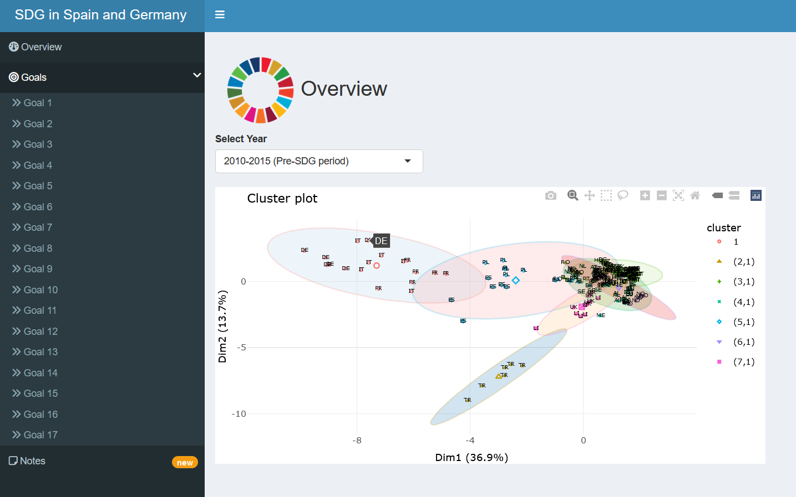

# TFM
The following files contain the essential code to run a factor, cluster and trend analysis of the United Nations Sustainable Development Goals implemented in 2015. This is part of the Master Thesis of the course in Computational Social Sciences of the UC3M. Data is available in Eurostat database web page. 

## Installation
- Prerequisites to have `R` and an `rmd` reader installed. 
- Then `git clone` the [TFM repository](https://github.com/victoriacsalamanca/TFM.git).
- Install dependencies (`install_dependencies.R`)

## Usage
The following steps are required to be performed in the order given. The first time all the files are run, they must be run in the order given in their name. 
1. Run `1-preprocessing-clustering.rmd` which provides the database needed to continue with the analysis.
2. Run `2-preprocessing-trends.rmd` which provides the database needed to perform the trend analysis.
3. Run `3-clustering_analysis.rmd` which performs and synthesises the clustering analysis of the preprocessed data. 
4. Run `4-factor_analysis.rmd` in which the factor analysis of the preprocessed data is performed and synthesised. 
5. Run `5-trends_analysis.rmd` this file is a complement to the dashboard and the previous files, it generates graphs that are shown in the Dashboard.
6. Run `6-APP.rmd` which generates the final Dashboard and gathers all the information extracted from the analyses.

## Example

